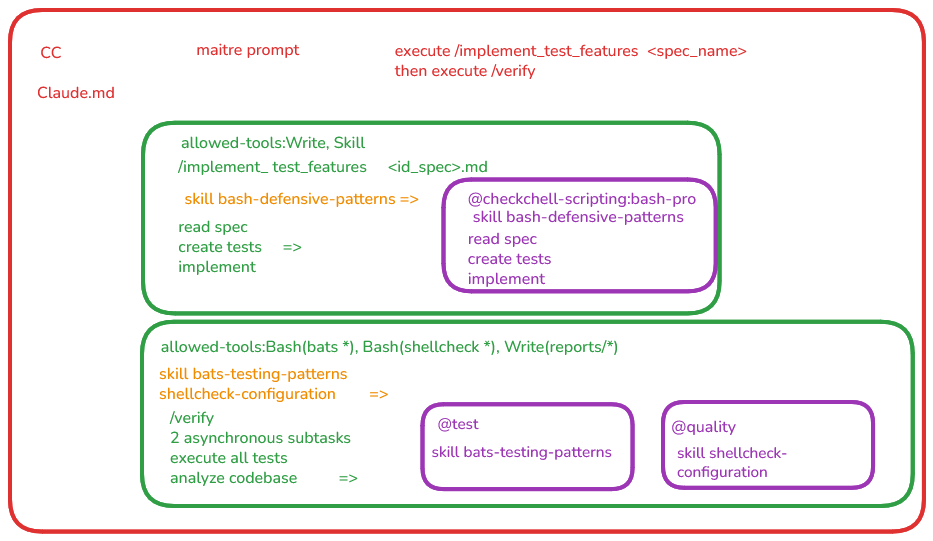

# Formation du 17-18/09/2026: Claude Code pour administrateurs

- le plan de formation est disponible dans le fichier [docs/PLAN.md](docs/PLAN.md)

Déroulé de la formation:

* introduction sur le vocabulaire: éléments du vocabulaire 
  - cf [docs/00-ai-assist-vocabulary.md](docs/00-ai-assist-vocabulary.md)
  - en annexe: [docs/01-choisir-model.md](docs/01-choisir-model.md)

* premiers pas avec claude code: 
  - cf [docs/01-cc-simple-use.md](docs/01-cc-simple-use.md) sans sandbox
  - sessions / modèle / effort / commandes / skill / agents / MCP

> REM1 j'ai eu des hésitations dans les gestions de sessions et les règles de permission claude/opencode car je les confonds souvent.

* utilisation d'une sandbox pour claude code: 
  - cf [docs/01-cc-docker-sandbox.md](docs/01-cc-docker-sandbox.md) avec sandbox
  - j'avais rajouté une version ubuntu 26.04 (seule distro qui peut utiliser les sandboxes docker) mais j'ai expliqué que cette version n'avait pas été testée
  - j'ai également ajouté un exemple de **sandbox** artisanale dans le sous dossier `./custom_sbx`

> REM2: le scénario sandbox est trop gros
> la VM contient claude et une cible connectée par ssh (même chose avec la sandbox artisanale) pour lancer des playbook ansible (bonus possibles vus avec l'audit d'avril)
> le câblage est trop difficile à expliquer
> autre Difficulté, le montage des plugins globaux claude code dans la sandbox pour réutiliser les plugins de l'utilisateur dans toute sandbox sans le retélécharger. ce n'était pas une bonne idée.

> REM3 j'ai eu une erreur de gestion du credential Claude Code + OpenRouter avec la sandbox le vendredi après midi
> pas de pb dans sandbox, pas de pb avec la licence CC (avant août)
> par manque de temps, j'avais fait les vérifications superficielles (est ce qu'on voit les modèles, pas de message d'erreur) mais les call passaient en 401.

> REM4 en fait impossible d'expliquer le kit spec.yaml (qui est important pour des amdins pour isoler l'environnment du harnais et ses agents.) dans le temps imparti

* création d'un workflow ia pour claude code: 
  - cf [docs/02-cc-scripting-workflow.md](docs/02-cc-scripting-workflow.md) avec sandbox
  - le sous dossier `./workshop` à déporter en dehors du dossier formation pour en faire un dépôt standalone.
  - la boucle à faire est dans  workshop

> REM5 ici je ne pouvais pas exactement les résultats bats tous en échec vs la avant veille (exécution non déterministe) mais j'ai pu montrer que le workflow était bien en place.

> REM6 même chose avec shellcheck au delà de l'installation de l'outil par manque de compétence/temps.

