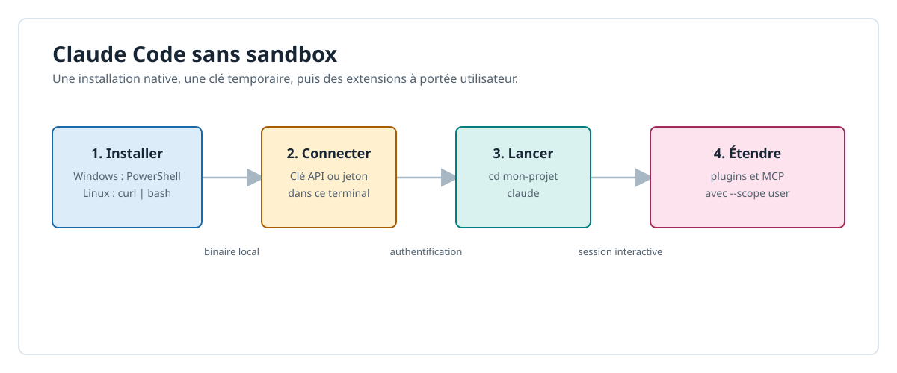
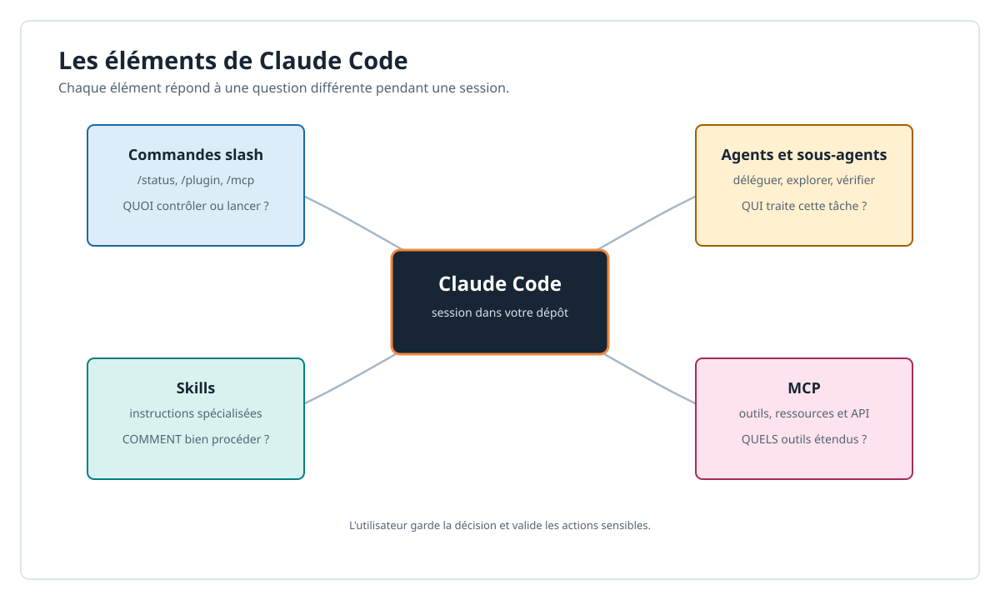

# Claude Code sans sandbox : démarrage simple

Ce guide installe Claude Code directement sur le poste, sans Docker, WSL ni `sbx`.
Les exemples de configuration utilisent la portée **utilisateur** : ils sont privés,
persistants pour votre compte et disponibles dans tous vos projets.

> Claude Code peut modifier des fichiers et lancer des commandes avec vos droits
> utilisateur. Travaillez dans un dépôt Git, relisez les actions proposées et ne
> donnez à un MCP que les autorisations dont il a besoin.

## Schéma de démarrage



## 1. Installation

### Windows 10/11 natif

Ouvrez PowerShell, sans droits administrateur, puis installez Claude Code :

```powershell
irm https://claude.ai/install.ps1 | iex
```
> il faut ajouter le chemin ~\.local\bin à la variable d'environnement PATH.

Git for Windows est recommandé : il permet à Claude Code d'utiliser Git Bash. Sans
Git for Windows, Claude Code utilise PowerShell pour les commandes système.

### Linux

Sur une distribution Linux prise en charge, installez Claude Code depuis un terminal :

```bash
curl -fsSL https://claude.ai/install.sh | bash
```

Pour une installation gérée par la distribution sur Debian ou Ubuntu, la procédure
`apt` officielle est aussi disponible dans la documentation Anthropic.

### Vérifier puis ouvrir un projet

Fermez et rouvrez le terminal si `claude` n'est pas trouvé, puis vérifiez
l'installation :

```bash
claude --version
claude doctor
```

Placez-vous dans le dépôt sur lequel vous travaillez et lancez une session :

```bash
cd mon-projet
claude
```

## 2. Connexion avec une clé d'API

Pour une clé API Anthropic directe, définissez `ANTHROPIC_API_KEY` dans le terminal
actuel. Ne placez pas une clé en clair dans Git, un fichier `.env` versionné ou la
ligne de commande enregistrée dans l'historique.

**PowerShell** : la saisie est masquée et la variable disparaît lorsque vous fermez
ce terminal.

```powershell
$secret = Read-Host -AsSecureString "Clé API Anthropic"
$env:ANTHROPIC_API_KEY = [System.Net.NetworkCredential]::new('', $secret).Password
Remove-Variable secret
claude
```

**Linux** :

```bash
read -rs -p "Clé API Anthropic : " ANTHROPIC_API_KEY; echo
export ANTHROPIC_API_KEY
claude
```

À la fin de la session, retirez la clé du processus si nécessaire :

```powershell
Remove-Item Env:ANTHROPIC_API_KEY
```

```bash
unset ANTHROPIC_API_KEY
```

### Clé d'un provider ou d'une passerelle

Utilisez cette variante lorsqu'un provider fournit un endpoint compatible avec l'API
Messages d'Anthropic et attend un jeton Bearer. Remplacez l'URL par celle publiée par
votre provider ; `ANTHROPIC_AUTH_TOKEN` est prioritaire sur `ANTHROPIC_API_KEY`.

```powershell
$env:ANTHROPIC_BASE_URL = "https://provider.example.com/v1"
$secret = Read-Host -AsSecureString "Jeton du provider"
$env:ANTHROPIC_AUTH_TOKEN = [System.Net.NetworkCredential]::new('', $secret).Password
Remove-Variable secret
claude
```

```bash
export ANTHROPIC_BASE_URL="https://provider.example.com/v1"
read -rs -p "Jeton du provider : " ANTHROPIC_AUTH_TOKEN; echo
export ANTHROPIC_AUTH_TOKEN
claude
```

Ne supposez pas qu'une clé arbitraire est compatible : pour Amazon Bedrock, Google
Cloud ou Microsoft Foundry, utilisez la configuration spécifique du provider proposée
par Claude Code. Dans Claude Code, `/status` indique la méthode d'authentification et
le provider effectivement utilisés.

> <span style="color: gold;font-size:12px"><strong><ins>CONFIDENTIALITE:</ins></strong></span> <br/> 
> <span style="color: gold;font-size:12px"><strong>désactiver la télémetrie dans Claude Code avec la variable d'environnement CLAUDE_CODE_DISABLE_NONESSENTIAL_TRAFFIC ou dans les réglages utilisateur.</strong></span>

## 3. les éléments de base du harnais Claude Code

1. désactiver certaines config dans /config ou cf `.claude/settings.json`

2. sélectionner le **modèle** : `/model`

3. sélectionner le niveau **d'effort**: `/effort`

4. sélectionner le **mode** (agent principaux) avec `Shift+Tab` :
   - mode **manual** (par défaut) : l'agent principal attend vos instructions
   - mode **plan**: l'agent principal propose un plan d'action et attend votre approbation ==> **READONLY**
   - mode **auto** : l'agent principal agit de manière autonome, en respectant les permissions

5. <ins>sessions</ins>
   - quand on lance Claude Code, CC crée une nouvelle session, avec le premier prompt.
   - créer une nouvelle session : `/clear` ou `clear [session-name]`
   - reprendre une autre session: `/resume [session-name]`

> <span style="color: gold;font-size:12px"><strong><ins>Règle d'or:</ins></strong></span> <br/> 
> <span style="color: gold;font-size:12px"><strong>en changeant de thématique, de projet ou de contexte, on DOIT créer une nouvelle session. Pour éviter les **hallucinations** de contexte.</strong></span>


## 4. Installer un plugin pour l'utilisateur

Les plugins peuvent apporter des **commandes**, **agents**, **skills**, **hooks**, **MCP** ou **LSP**. Inspectez leur contenu et n'installez que des **marketplaces** de confiance : un
plugin peut exécuter du code avec vos droits utilisateur.

Ajoutez une fois la marketplace officielle, puis installez un plugin pour tous vos
projets :

```bash
claude plugin marketplace add anthropics/claude-plugins-official
claude plugin install commit-commands@claude-plugins-official --scope user
```

Vérifiez l'installation, puis ouvrez ou rechargez une session Claude Code :

```bash
claude plugin list
claude plugin details nom-plugin@nom-marketplace
claude
```

Dans une session déjà ouverte, lancez `/reload-plugins` pour charger le plugin. Ses
skills sont préfixés par son nom, par exemple `/commit-commands:commit`.

### exemples de commmandes / skills / agents

#### 1. exemple de commande avec entêtes

```
~/.claude/commands : global
~/.claude/plugins/cache/marketplace/commit-commands/vx.y.z/commands : dans un plugin
project/.claude/commands : dans le projet

commands/
    commit.yaml
  
```

```markdown

---
allowed-tools: Bash(git add:*), Bash(git status:*), Bash(git commit:*)
description: Create a git commit
model: haiku
argument-hint: [message]
---

## Context

BLABLA

## Your task

Based on the above changes, create a single git commit.

BLABLA
if $1 exists, use its value to force the commit message.

```

> description est **affichée dans la commande** en TUI
> argument-hint est **affichée dans la commande** en TUI en auto-completion
> $1, $2, ... sont les arguments passés à la commande slash
> $ARGUMENTS est un tableau contenant tous les arguments passés à la commande slash

#### 2. exemple de skill avec entêtes

```
~/.claude/skills : global
~/.claude/plugins/cache/marketplace/shell-scripting/vx.y.z/skills : dans un plugin
project/.claude/skills : dans le projet

skills/
    bash-defensive-patterns/
	    SKILL.md
		auxiliary_file.md
```

```markdown
---
name: bash-defensive-patterns
description: Apply defensive patterns in bash scripts
allowed-tools: ...
model: haiku
---

KNOWLEDGE
```

#### 3. exemple d'agent avec entêtes

```
~/.claude/agents : global
~/.claude/plugins/cache/marketplace/shell-scripting/vx.y.z/agents : dans un plugin
project/.claude/agents : dans le projet

agents/
    bash-pro.md
```

```markdown
---
name: bash-pro
description: Master of defensive Bash scripting for production automation, CI/CD pipelines, and system utilities. Expert in safe, portable, and testable shell scripts.
model: sonnet
---

PERSONA

peut utiliser des skills et des mcps explicitement autorisés dans les réglages du projet.
le script dévolu à l'agent par l'agent principal est exécuté dans un sous-processus, est isolé des skills de l'agent parent.

```

##### Règles de base pour les agents

* il y a 3 **agents principaux** : manual (par défaut), plan, auto. Les sous-agents sont toujours en mode manual.

* un agent créé par un plugin ou par l'utilisateur est un **sous-agent**, qui peut être délégué par l'agent principal dans un prompt maitre

* plusieurs sous-agents délégués par l'agent principal dans un prompt maitre **dans l'ordre OU en parallèle à discrétion**

## 4. Installer des MCP pour l'utilisateur

* Un serveur MCP ajoute à Claude Code des outils externes et, selon le serveur, des ressources et
des prompts. 
* La portée utilisateur les enregistre dans votre configuration privée et les rend disponibles dans tous vos projets.

### MCP HTTP distant

L'exemple suivant ajoute Context7. Adaptez le nom et l'URL au MCP choisi :

```bash
claude mcp add --scope user --transport http context7 https://mcp.context7.com/mcp
claude mcp get context7
claude mcp list
```

Un MCP distant qui utilise OAuth doit être autorisé une fois. Ouvrez Claude Code et
utilisez `/mcp`, ou lancez la connexion depuis le terminal :

```bash
claude mcp login context7
```

### MCP local en `stdio`

Les MCP locaux sont des processus lancés sur votre poste. Conservez le séparateur
`--` : tout ce qui suit est transmis au serveur MCP, pas à Claude Code.

```bash
claude mcp add --scope user --transport stdio mon-outil -- npx -y <paquet-mcp-de-confiance>
claude mcp get mon-outil
```

Pour supprimer une configuration utilisateur devenue inutile :

```bash
claude mcp remove context7 --scope user
```

### configuration JSON d'un MCP

```
~/.claude.json: section "projects" { "mcpServers": { ... } }
project/
   .mcp.json
```

```jsonc
{
  "mcpServers": {
    "context7": {
	  // local ou stdio
      "command": "npx",
      "args": ["-y", "@upstash/context7-mcp"]
    },
    "github": {
	  // distant
      "type": "http",
      "url": "https://api.githubcopilot.com/mcp/",
      "headers": {
        "Authorization": "Bearer ${GITHUB_TOKEN}"
      }
    }
  }
}
```

## 5. Synthèse des éléments de base pour l'assistance IA 

| Élément | Rôle | Question à se poser |
| --- | --- | --- |
| Commandes slash | Des commandes interactives intégrées ou fournies par un plugin, comme `/help`, `/status`, `/mcp` ou `/plugin`. Elles déclenchent une action précise. | **Quoi** veux-je demander ou contrôler maintenant ? |
| Agent principal et sous-agents | L'agent principal conduit la session. Il peut déléguer un travail ciblé à un sous-agent, avec un contexte et parfois des outils distincts, puis exploiter son résultat. | **Qui** doit réaliser ou vérifier cette partie du travail ? |
| Skills | Des instructions spécialisées que Claude charge lorsqu'elles correspondent à une tâche. Elles définissent méthode, contraintes et outils adaptés. | **Comment** cette tâche doit-elle être réalisée ? |
| MCP | Des serveurs qui étendent les outils de Claude vers des systèmes externes : documentation, tickets, Git, bases de données ou API. | De quels **outils étendus** et de quelles données Claude a-t-il besoin ? |

Les quatre éléments sont complémentaires : une commande peut piloter une action, un
agent peut déléguer à un sous-agent, un skill guide l'exécution et un MCP fournit les
capacités externes nécessaires. Aucun ne remplace la revue humaine pour une action
sensible ou irréversible.

### Vue générale



## 6. Régler le projet avec `.claude/settings.json` et `CLAUDE.md`

Les réglages changent le comportement et les permissions de Claude Code ; les
instructions décrivent comment travailler dans le dépôt. Gardez-les séparés :

| Fichier | Portée | À versionner | Usage |
| --- | --- | --- | --- |
| `~/.claude/settings.json` | Utilisateur | Non | Préférences privées communes à tous les projets |
| `.claude/settings.json` | Projet | Oui | Garde-fous partagés par l'équipe |
| `.claude/settings.local.json` | Projet, utilisateur courant | Non | Exceptions locales, déjà ignorées par Git |
| `CLAUDE.md` | Projet ou sous-répertoire | Oui | Conventions et procédure de travail |

### Réglages principaux

* Créez `.claude/settings.json` pour des permissions communes, minimales et relues.
* L'exemple suivant autorise les contrôles locaux sans confirmation, demande une confirmation pour les opérations qui publient ou accèdent à distance et interdit la lecture des secrets :

```jsonc
{
	"$schema": "https://json.schemastore.org/claude-code-settings.json",
	"permissions": {
		"defaultMode": "default",
		// interdire le mode YOLO
		"disableBypassPermissionsMode": "disable",
		// interdure le chgt intempestif d'agent principal
		"disableAutoMode": "disable",
		// interdire la lecture de fichiers en dehors du projet
		"blockReadsOutsideWorkingDirectories": true,
		// interdire télémétrie et tracking
		"disableNonessentialTraffic": true,
		"allow": [
			"Bash(git status *)",
			"Bash(git diff *)",
			"Bash(npm test *)"
		],
		"ask": [
			"Bash(git commit *)",
			"Bash(git push *)",
			"Bash(ssh *)",
			// outils externe de mcps dans /mcp
			"mcp__github__*"
		],
		"deny": [
			"Read(.env)",
			"Read(.env.*)",
			"Read(secrets/**)",
			"Bash(curl *)",
			"Bash(wget *)"
		]
	}
}
```

* `allow` exécute sans question, `ask` demande une approbation et `deny` bloque.

> <span style="color: gold;font-size:12px"><strong><ins>Règle de préséance:</ins></strong></span><br/>
> <span style="color: gold;font-size:12px"><strong>DENY >> ASK >> ALLOW</strong></span><br/>
> <span style="color: gold;font-size:12px"><strong>QUELQUE SOIT L'ENDROIT: settings / command / skill / agent</strong></span>

* N'ajoutez jamais de jeton, mot de passe ou clé privée à ce fichier : passez-les par les variables d'environnement
* **OU SURTOUT** le gestionnaire de secrets adapté (VAULT, 1Password, etc., pass/gpg2). 

### Constitution de `CLAUDE.md`

* Placez `CLAUDE.md` à la racine ou exécutez la commande `/init` pour les règles qui concernent tout le dépôt. 
* Un `CLAUDE.md` dans un sous-répertoire ne doit contenir que les règles spécifiques à cette partie du code. 
* Ce fichier est une mémoire de travail versionnée, pas un journal de discussion ni une copie du README.

* Une base utile tient en quelques rubriques :

```markdown
# Instructions du projet

## Commandes de validation
- `npm test`
- `npm run lint`

## Conventions
- Conserver les changements ciblés et couvrir les corrections par un test.
- Ne pas modifier les fichiers générés dans `dist/`.

## Sécurité
- Ne jamais lire, afficher ou versionner les fichiers `.env`.
- Demander confirmation avant toute publication, migration ou action distante.
```

* Préférez des consignes courtes **(< 300 lignes)**, impératives et vérifiables : chemins à modifier ou à
* éviter, commandes de test exactes, conventions locales et décisions de sécurité.
* Supprimez les règles devenues fausses, évitez les longues explications
* Ne dupliquezpas les instructions générales de Claude Code. 
* Un bon `CLAUDE.md` réduit les ambiguïtés sans ajouter de contexte inutile à chaque session.

### Références officielles

- [Installation et diagnostic](https://code.claude.com/docs/en/setup)
- [Authentification et ordre de priorité des credentials](https://code.claude.com/docs/en/authentication)
- [Plugins et marketplaces](https://code.claude.com/docs/en/discover-plugins)
- [MCP, portées et authentification](https://code.claude.com/docs/en/mcp)
- [Réglages, permissions et fichiers d'instructions](https://code.claude.com/docs/en/settings)
