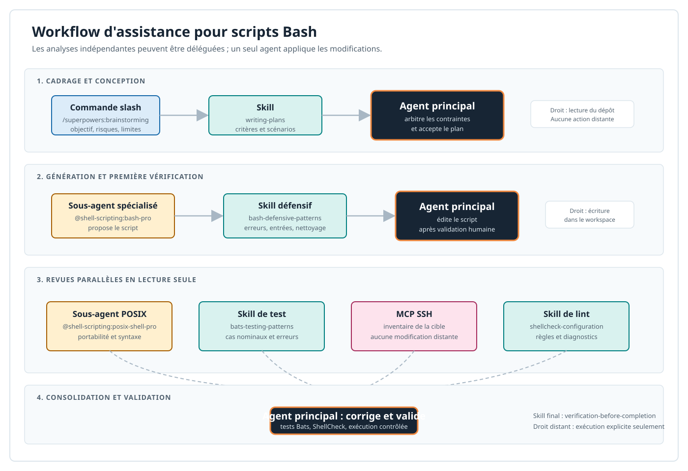

# Workflow Claude Code pour les scripts Bash

Ce workflow couvre la génération, le durcissement et la revue de scripts Bash.
Il distingue les étapes séquentielles, les revues parallélisables et les droits
nécessaires. L'agent principal reste responsable de l'arbitrage, des modifications
et de toute action pouvant changer un système.



## Vue d'ensemble

| Phase | Objectif | Éléments Claude Code |
| --- | --- | --- |
| Cadrage | Définir le besoin, les limites et les critères d'acceptation | Agent principal, skills `brainstorming` et `writing-plans` |
| Génération | Produire une première version lisible et défensive | Sous-agent `bash-pro`, skill `bash-defensive-patterns` |
| Revue parallèle | Vérifier séparément portabilité, tests, lint et cible | Sous-agent `posix-shell-pro`, skills Bats et ShellCheck, MCP SSH en lecture seule |
| Consolidation | Appliquer les corrections retenues | Agent principal avec écriture dans le dépôt |
| Validation | Exécuter les tests et obtenir une preuve de fonctionnement | Skills de test et de vérification, MCP SSH sur autorisation explicite |

Les sous-agents produisent des rapports : fichiers concernés, risque, justification
et correctif proposé. Ils ne modifient pas le même script en parallèle. L'agent
principal consolide les résultats avant toute écriture.

## Éléments du workflow

### Agent principal

L'agent principal conduit la session, demande les informations manquantes, choisit
les sous-agents et décide des corrections à appliquer. Il doit conserver une liste
explicite des hypothèses, des risques et des commandes prévues.

Permissions attendues : lecture du dépôt pendant le cadrage ; écriture limitée au
workspace après validation du plan ; exécution locale des tests après revue ; accès
SSH uniquement lorsqu'une action ou une vérification distante a été explicitement
approuvée.

### Sous-agent de génération Bash

Utiliser `@shell-scripting:bash-pro` pour proposer un script ou une modification
ciblée. Le skill `/shell-scripting:bash-defensive-patterns` fournit le cadre :
validation des paramètres, gestion des erreurs, fichiers temporaires, `trap`,
journalisation et codes de retour.

Permissions attendues : lecture du dépôt et des exigences. Par défaut, aucune
écriture ni exécution distante. L'agent principal applique la proposition retenue.

### Sous-agent de portabilité

Utiliser `@shell-scripting:posix-shell-pro` lorsqu'un script doit pouvoir s'exécuter
avec `sh`, sur plusieurs distributions ou dans une CI minimale. Il identifie les
constructions dépendantes de Bash, les commandes non disponibles et les hypothèses
sur l'environnement.

Permissions attendues : lecture seule. Le résultat est un rapport de compatibilité,
pas une modification directe.

### Skills de test et de lint

Le skill `/shell-scripting:bats-testing-patterns` conçoit les tests Bats : cas
nominal, options invalides, fichiers absents, permissions et erreurs de commandes.
Le skill `/shell-scripting:shellcheck-configuration` guide la configuration et
l'interprétation de ShellCheck.

Permissions attendues : lecture des scripts et des tests. L'agent principal peut
créer les fichiers de test et exécuter `bats` ou `shellcheck` dans le workspace.
Les tests qui modifient le système doivent utiliser un répertoire temporaire ou une
cible isolée.

### MCP

Les MCP ne sont activés que lorsqu'ils apportent une capacité nécessaire :

| MCP | Usage dans ce workflow | Permission attendue |
| --- | --- | --- |
| `mcp-ssh` | Inventaire de la cible, exécution de tests sur la cible sandbox | Lecture et commandes non mutantes par défaut ; actions mutantes après approbation explicite |
| `mcp-fs` | Lecture de fichiers ou d'arborescences hors workspace, si nécessaire | Lecture limitée aux chemins autorisés |
| `context7` | Vérification d'une documentation d'outil ou d'API | Lecture seule, accès réseau nécessaire |
| `mcp-ansible` | Atelier qui produit ou relit de l'automatisation Ansible | Lecture et conseil ; exécution Ansible uniquement après approbation |
| GitHub ou GitLab | Consulter une issue, une MR/PR ou une CI | Lecture par défaut ; écriture distante explicitement autorisée au cas par cas |

`mcp-docker` ne fait pas partie du workflow Compose simple : ce mode n'expose aucun
démon Docker. Il reste disponible dans la variante `sbx` lorsque le kit fournit son
démon Docker isolé.

### Découvrir les outils MCP avant de définir leurs permissions

Ne déduisez pas le droit à accorder du seul nom du serveur : un même MCP peut exposer
des opérations de lecture et des opérations mutantes. Dans une session interactive,
ouvrez `/mcp`, sélectionnez le serveur et vérifiez qu'il est connecté ; ce panneau
affiche aussi le nombre d'outils déclarés. Depuis le terminal, les commandes suivantes
vérifient la configuration et l'état du serveur :

```bash
claude mcp list
claude mcp get mcp-ssh
```

Ces commandes ne listent pas le catalogue détaillé des outils. Pour relever les noms
canoniques sans agir sur la cible, utilisez l'Inspector MCP contre le serveur, puis
consultez la réponse `tools/list`. Par exemple, pour un serveur stdio lancé par `uvx` :

```bash
npx @modelcontextprotocol/inspector uvx mcp-ssh
```

Dans l'Inspector, configurez si nécessaire les mêmes variables d'environnement que
dans [`.mcp.json`](../.mcp.json), connectez-vous au serveur et ouvrez la liste des
outils. Cette étape lance le serveur, mais n'exécute aucun de ses outils ni aucune
commande distante.

Le raccourci `/` de Claude Code liste des *prompts* MCP (par exemple
`/serveur:prompt`) ; ce ne sont pas les outils à placer dans les permissions. Pour
valider le nom réellement appelé par Claude Code, démarrez une session avec
`claude --verbose`, demandez une opération de lecture inoffensive et copiez le nom
du tool call affiché. Pour un serveur fourni par un plugin, ce nom inclut le préfixe
du plugin : `mcp__plugin_<plugin>_<serveur>__<outil>`.

Chaque nom relevé se traduit en règle Claude Code sous la forme
`mcp__<serveur>__<outil>`. Les trois niveaux possibles sont :

```json
{
	"permissions": {
		"allow": ["mcp__context7__resolve-library-id"],
		"ask": ["mcp__mcp-ssh"],
		"deny": ["mcp__github__create_*"]
	}
}
```

`mcp__mcp-ssh` et `mcp__mcp-ssh__*` couvrent tous les outils de ce serveur. Une règle
`ask` prévaut sur une règle `allow`, et une règle `deny` prévaut sur les deux ; évitez
donc une règle globale tant que vous n'avez pas séparé les outils de lecture des outils
mutants. Vérifiez enfin le fichier de paramètres résolu avec `claude doctor` avant de
l'utiliser dans un atelier.

## Permissions globales attendues

Le workflow suppose le principe du moindre privilège. Commencer une session sans
contourner les confirmations de Claude Code et sans utiliser
`--dangerously-skip-permissions`.

| Surface | Permission par défaut | Extension justifiée |
| --- | --- | --- |
| Dépôt | Lecture | Écriture uniquement par l'agent principal, après plan validé |
| Shell local | Commandes d'observation et tests réversibles | Commande mutante après affichage et confirmation |
| Système distant | Aucune exécution au cadrage | SSH vers une cible isolée, commande ciblée et validée |
| Réseau | Seulement les hôtes nécessaires aux MCP, registres et documentation | Ajout d'un hôte après justification dans le kit ou la politique réseau |
| Secrets | Aucun secret dans prompts, scripts ou logs | Injection par `sbx secret set` ou variable locale non versionnée |
| Git distant | Lecture des informations nécessaires | Création de branche, push ou commentaire après approbation explicite |

Dans le sandbox `sbx`, la liste des domaines et l'injection des secrets sont définies
par [kit/spec.yaml](../kit/spec.yaml). Dans la variante Compose, les variables de
secret restent dans `custom_sbx/.env`, non versionné ; l'isolation est moins forte et
la politique réseau doit être appliquée par l'environnement Docker ou le réseau de
l'organisation.

## Démarrer une session

Vérifier d'abord les composants disponibles :

```text
/mcp
/skills
/context
```

Puis amorcer le workflow avec les commandes suivantes :

```text
/superpowers:brainstorming
Définis les entrées, sorties, OS cibles, droits requis, données sensibles,
conditions d'échec, journalisation et critères d'acceptation pour ce script.

/superpowers:writing-plans
Établis un plan de mise en oeuvre et de test. Ne modifie aucun fichier.

@shell-scripting:bash-pro
Propose une première version Bash suivant le plan, sans modifier le dépôt.

/shell-scripting:bash-defensive-patterns
Relis cette proposition : paramètres, chemins, erreurs, trap, logs et codes retour.
```

Après production du script, lancer les revues indépendantes en parallèle :

```text
Utilise des sous-agents en parallèle, sans modifier de fichier :
1. @shell-scripting:posix-shell-pro : rapport de portabilité.
2. Applique /shell-scripting:bats-testing-patterns : cas de test Bats.
3. Applique /shell-scripting:shellcheck-configuration : diagnostics ShellCheck.
4. Avec mcp-ssh, inventorie la cible sans la modifier.
Retourne fichier, problème, impact et correctif proposé.
```

Enfin, demander à l'agent principal de consolider les résultats, de créer les tests
retenus, puis d'exécuter les validations. Terminer par :

```text
/superpowers:verification-before-completion
Vérifie le plan, les tests Bats, ShellCheck, les codes retour et l'absence de
modification distante non approuvée avant de conclure.
```

## Contrôles minimaux

Avant de livrer un script, documenter la commande de test, la cible utilisée, les
prérequis et les effets attendus. Vérifier au minimum :

```bash
bash -n script.sh
shellcheck script.sh
bats tests/
```

Ajouter les tests d'intégration sur la cible isolée seulement après ces contrôles
locaux et avec une commande explicitement validée.

## gestion du branching git

1. /pull issue_id (à faire): chaque issue sortant du blacklog assigné à l'utilisateur doit générer une branche dédié qu'on fait descendre dans la sandbox
   + le mieux est d' installer dans la sandbox un dépôt de spec local **beads**
   + demande le mcp et un token d'accès (Jira / github / gitlab / gitea)

2. quand la boucle TDD est validée, on pousse avec le mcp et le token